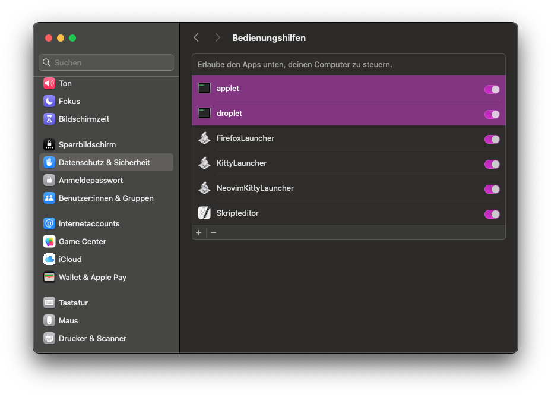
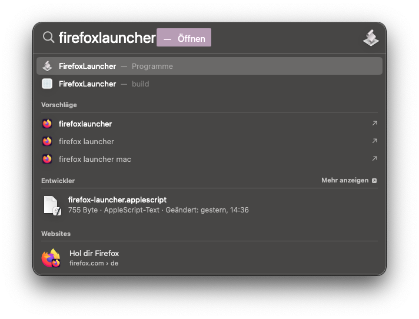
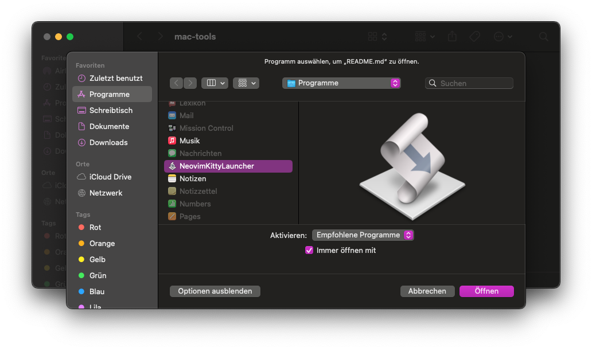

# Mac Tools

Tools for working with MacOS

Licensed under [**CC BY-SA 4.0**](./LICENSE.md)

- - -

## Installation

There is an installation script that must be run as a user in the `admin` group.
It will automatically install the tools to your system.

```sh
./install.sh
```

You can also install it by creating a *Shortcuts*-Shortcut or an *Automator*-Program
or manually compiling or running the script from an editor or with `osascript`/`osacompile`.

Once installed, you must grant permissions for some of the apps to do things like entering keystrokes or clicking on menu bar items.



## Examples





## List of Tools

- [**Firefox Launcher**](./applescript/firefox-launcher.applescript): AppleScript that always launches a new Window for the Firefox Web Browser
- [**Kitty Launcher**](./applescript/kitty-launcher.applescript): AppleScript that always launches a new Window for the Kitty Terminal
- [**Neovim Kitty Launcher**](./applescript/neovim-kitty-launcher.applescript): AppleScript that launches the Kitty Terminal with Neovim (and optionally a file), can be used for opening files with nvim

